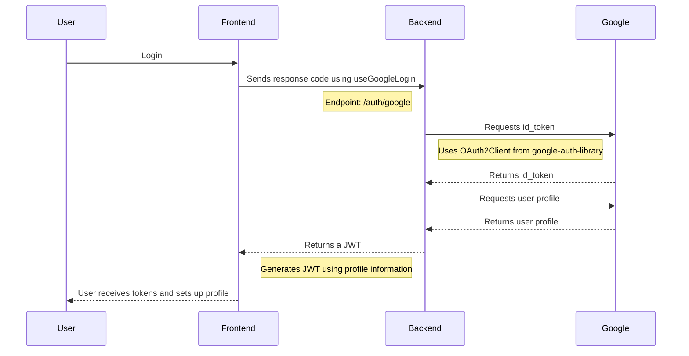
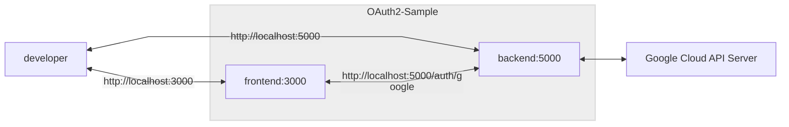

# Google-OAuth2.0-Sample
OAuth 2.0 Sample Code for Web Using React.js and Node.js

To run this project, you must first set up the OAuth consent screen and credentials (OAuth 2.0 client ID) in the Google Cloud Console.

If you need help setting it up, please refer to the links below.

## How it works

### Sequence Diagram

### Flowchart

## Reference Links
OAuth2 API Usage
- https://react-oauth.vercel.app/
- https://developers.google.com/identity/sign-in/web/backend-auth?hl=ko#node.js

Frontend UI and Source code (possibly using OAuth1)
- https://muhammedsahad.medium.com/react-js-a-step-by-step-guide-to-google-authentication-926d0d85edbd
- https://github.com/Muhammed-Sahad-c/React-Google-Authentication

Google console Settings
- https://goldenrabbit.co.kr/2023/08/07/oauth%EB%A5%BC-%EC%82%AC%EC%9A%A9%ED%95%9C-%EA%B5%AC%EA%B8%80-%EB%A1%9C%EA%B7%B8%EC%9D%B8-%EC%9D%B8%EC%A6%9D%ED%95%98%EA%B8%B0-1%ED%8E%B8/